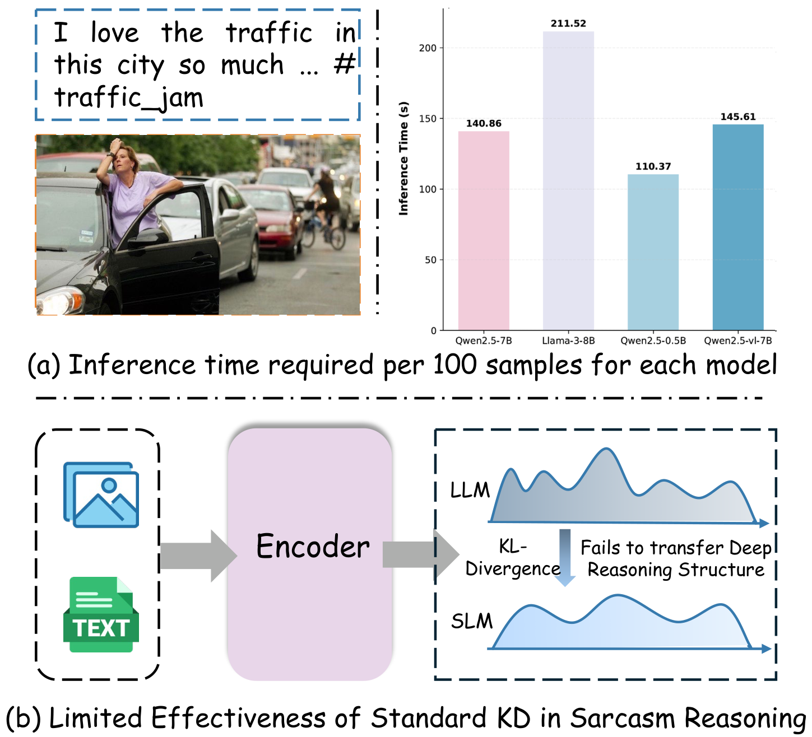
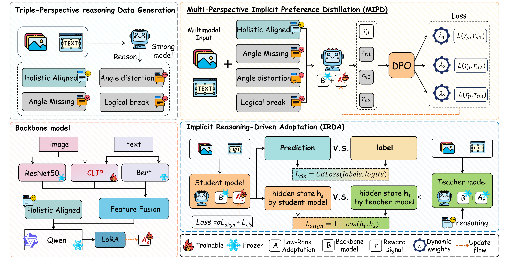
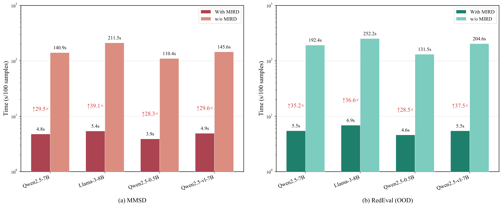

# MIRD: Multimodal Implicit Reasoning Distillation for Efficient Sarcasm Detection

<p align="center">
  <a href="https://doi.org/10.1145/3767308.3835865"></a>
  <a href="https://github.com/possion0/MIRD"></a>
</p>

Official PyTorch implementation of the paper **"MIRD: Multimodal Implicit Reasoning Distillation for Efficient Sarcasm Detection"** (ACM MM 2026).

MIRD distills the deep pragmatic reasoning ability of Large Language Models (LLMs) into a compact Small Language Model (SLM) for Multimodal Sarcasm Detection (MSD), while **completely bypassing autoregressive decoding at inference time** — achieving state-of-the-art accuracy with ~30× lower latency.

<p align="center">
  
</p>

## 📌 Overview

Existing MSD methods face a dilemma: traditional feature-fusion networks lack the deductive logic needed for deep pragmatic prediction, while LLM-based generative approaches suffer from prohibitive inference latency caused by token-by-token generation.

MIRD addresses this with three core designs:

1. **Cross-modal alignment network** — ResNet50 + CLIP + BERT extract fine-grained features, which are interleaved by multi-level attention for early-stage, deep cross-modal coupling.
2. **Multi-Perspective Implicit Preference Distillation (MIPD)** — a teacher LLM generates a winning CoT trajectory together with three *structurally defective* negative trajectories (modality missing, angle distortion, logic broken). DPO is applied directly in the **implicit reasoning space** of a learnable reasoning token, so the SLM internalizes where and why logical inference fails.
3. **Implicit Reasoning-Driven Adaptation (IRDA)** — the converged implicit reasoning state $h_r$ is mapped straight to the classification boundary, entirely skipping text generation at inference.

<p align="center">
  
</p>

## 📈 Main Results

| Model | MMSD Acc (%) | MMSD F1 (%) | MMSD2.0 Acc (%) | MMSD2.0 F1 (%) |
| :--- | :---: | :---: | :---: | :---: |
| MIRD (Qwen2.5-0.5B) | 92.54 | 90.42 | 90.79 | 89.25 |
| **MIRD (Qwen2.5-7B)** | **93.96** | **92.41** | **91.89** | **90.56** |

MIRD also generalizes to the out-of-domain **RedEval** benchmark (89.40% ± 1.14% accuracy under 5-fold cross-validation).

## ⚡ Efficiency

By extracting a dense implicit reasoning state instead of generating text, MIRD reduces inference time by **~30×** across backbones (e.g., Llama-3-8B: 211.5s → 5.4s per 100 samples on MMSD).

<p align="center">
  
</p>

## 🚀 Getting Started

### 1. Environment

```bash
conda create -n mird python=3.10
conda activate mird
pip install -r requirements.txt
```

All experiments can be run on a single 24GB GPU (e.g., RTX 4090).

### 2. Data Preparation

We use the **MMSD**, **MMSD2.0**, and **RedEval** benchmarks. Place the data and models under the `src/` directory as follows (image files are named `{id}.jpg` according to the sample ids in the JSON files):

```
src/
├── MMSD2.0dataset/data/
│   ├── text_json_final/
│   │   ├── train.json / valid.json / test.json
│   │   └── train_reasoning_with_negatives.json / valid_reasoning_with_negatives.json
│   └── dataset_image/
├── MMSD2.0-main/openai/clip-vit-base-patch32/   # CLIP processor
└── qwen_path/                                   # local Qwen2.5-7B (or 0.5B) checkpoint
```

The `*_reasoning_with_negatives.json` files contain the triple-perspective preference data (winning CoT + three defective negatives) generated by GPT-4o-mini, and are used in Phase 3 (MIPD) and Phase 4 (IRDA).

> Note: when using the 0.5B backbone, adjust the projector `output_dim` / Qwen `hidden_size` in `src/config.py` accordingly.

### 3. Training

The whole pipeline contains four stages. Run the following commands inside `src/`.

**Phase 1: Perception pre-training** (cross-modal alignment network)

```bash
python train_phase1.py \
    --device 0 \
    --num_train_epochs 10 \
    --train_batch_size 32 \
    --learning_rate 5e-4 \
    --output_dir ../output_dir/phase1
```

**Phase 2: Projector alignment** (project multimodal features into the LLM space)

```bash
python train_phase2.py \
    --device 0 \
    --perception_checkpoint ../output_dir/phase1/perception_best.pth \
    --qwen_path /path/to/Qwen2.5-7B \
    --num_train_epochs 5 \
    --train_batch_size 8 \
    --output_dir ../output_dir/phase2
```

**Phase 3a: Reasoning instruction tuning** (LoRA adapter for reasoning)

```bash
python train_phase3_gen.py \
    --device 0 \
    --perception_checkpoint ../output_dir/phase1/perception_best.pth \
    --projector_checkpoint ../output_dir/phase2/projector_aligned.pth \
    --qwen_path /path/to/Qwen2.5-7B \
    --num_train_epochs 5 \
    --train_batch_size 4 \
    --gradient_accumulation_steps 4 \
    --output_dir ../output_dir/phase3
```

**Phase 3b: MIPD — implicit preference distillation** (DPO against defective trajectories)

```bash
python train_phase3_dpo.py \
    --device 0 \
    --train_batch_size 4 \
    --gradient_accumulation_steps 4 \
    --num_workers 4 \
    --qwen_path /path/to/Qwen2.5-7B \
    --lora_shared_path ../output_dir/phase3/lora_adapter \
    --perception_checkpoint ../output_dir/phase1/perception_best.pth \
    --projector_checkpoint ../output_dir/phase2/projector_aligned.pth \
    --train_reasoning_file ./MMSD2.0dataset/data/text_json_final/train_reasoning_with_negatives.json \
    --valid_reasoning_file ./MMSD2.0dataset/data/text_json_final/valid_reasoning_with_negatives.json \
    --output_dir ../output_dir/phase3_dpo \
    --num_train_epochs 5 \
    --beta 0.1
```

**Phase 4: IRDA — end-to-end classification** (bypass autoregressive decoding)

```bash
python train_phase4_end2end.py \
    --device 0 \
    --num_train_epochs 5 \
    --lora_shared_path ../output_dir/phase3/lora_adapter \
    --lora_reason_path ../output_dir/phase3_dpo/lora_reason_best \
    --output_dir ../output_dir/phase4_e2e
```

### 4. Inference

Evaluate the trained model on the test set:

```bash
python predict_phase4_end2end.py \
    --device 0 \
    --qwen_path /path/to/Qwen2.5-7B \
    --perception_checkpoint ../output_dir/phase1/perception_best.pth \
    --projector_checkpoint ../output_dir/phase2/projector_aligned.pth \
    --lora_shared_path ../output_dir/phase3/lora_adapter \
    --lora_class_path ../output_dir/phase4_e2e/lora_class_best \
    --class_head_path ../output_dir/phase4_e2e/class_head_best.pth \
    --test_file ./MMSD2.0dataset/data/text_json_final/test.json
```

## 🔗 Citation

If you find this work useful, please cite:

```bibtex
@inproceedings{liu2026mird,
  title     = {MIRD: Multimodal Implicit Reasoning Distillation for Efficient Sarcasm Detection},
  author    = {Liu, Ruipeng and Yu, Tianyuan and Bai, Liang and Sun, Siyang and Xue, Junhua and Guo, Yanming},
  booktitle = {Proceedings of the 34th ACM International Conference on Multimedia (MM '26)},
  year      = {2026},
  doi       = {10.1145/3767308.3835865}
}
```
